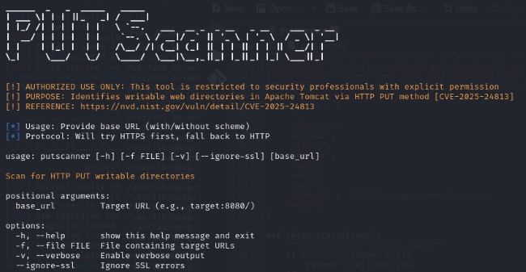
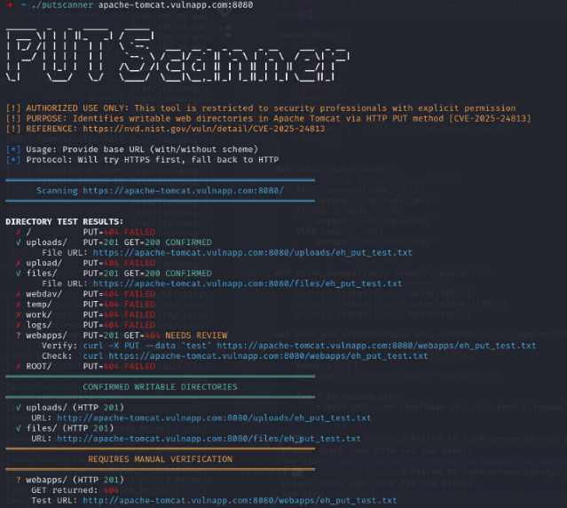

# 🔍 PUT Directory Scanner

A penetration testing tool that identifies writable web directories via HTTP PUT method, specifically designed to detect **CVE-2025-24813** (Arbitrary File Upload in Apache Tomcat).
## 📌 Features

- **Smart Protocol Handling**: Auto-detects HTTPS/HTTP with fallback
- **Comprehensive Checks**: Tests all common Tomcat directories
- **Two-Stage Verification**: PUT + GET validation to eliminate false positives
- **Pentester-Friendly Output**: Color-coded results with manual verification commands
- **CVE-Focused**: Optimized for detecting assets with pre-requisites for CVE-2025-24813 

## 🚀 Installation

```bash
git clone https://github.com/x00byte/PutScanner.git
cd PutScanner
```

## 🛠️ Usage

### Basic Scan
```bash
./putscanner.py target.com:8080
```
 <!-- Your main promotional image here -->
### Advanced Options
| Flag            | Description                          |
|-----------------|--------------------------------------|
| `-v`            | Verbose mode                         |
| `--ignore-ssl`  | Bypass SSL certificate verification |
| `-f targets.txt`| Scan multiple targets from file      |

## 🖥️ Demonstration

## 🧪 Test Environment Setup

1. Start the included test server:
```bash
python3 test_server.py
```

2. Run the scanner against it:
```bash
./putscanner.py http://localhost:8080 -v
```

## Live Test Results

Below is a demonstration of putscanner in use and the different scenarios it can test for.


 <!-- Your test server screenshot here -->

```

## 📜 Legal Disclaimer

**WARNING**: This tool is intended for **authorized penetration testing only**.
Unauthorized use against systems without explicit permission is illegal.


## 📄 License

MIT License - See [LICENSE](LICENSE) for full text.
